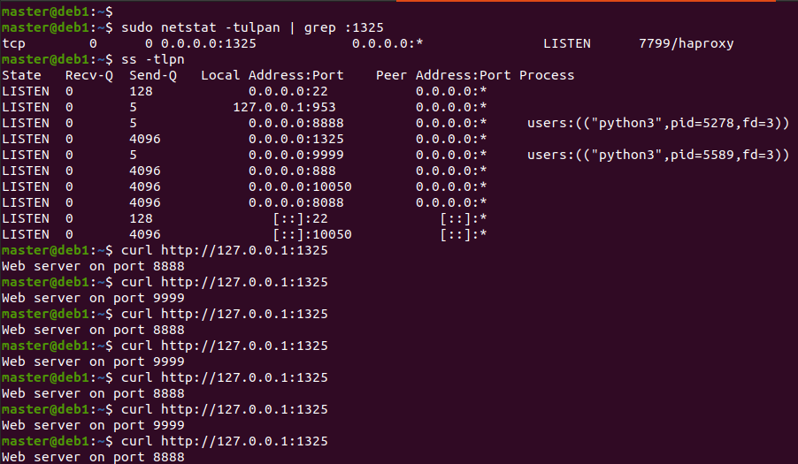
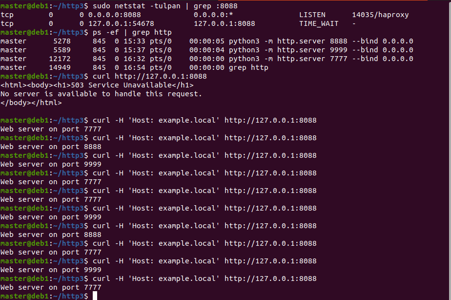

# Домашнее задание к занятию "`Кластеризация и балансировка нагрузки`" - `Аблогин Павел`

---

### Задание 1

1. `Запустил два simple python сервера на виртуальной машине на портах 8888, 9999`
2. `Установил и настроил HAProxy, настроил балансировку Round-robin на 4 уровне.`

[Конфигурационный файл haproxy](haproxy-task1.cfg)

`Скриншоты выполнения задания 1`

---

### Задание 2

1. `Запустил три python сервера на виртуальной машине на портах 7777, 8888, 9999`
2. `Настроил балансировку Weighted Round Robin на 7 уровне, чтобы сервер на пору 8888 имел вес 2, на 9999 - 3, а на 7777 - 4`
3. `HAproxy балансирует только http-трафик, адресованый домену example.local`

[Конфигурационный файл haproxy](haproxy-task2.cfg)

`Скриншот выполнения задания 2`
`

---

